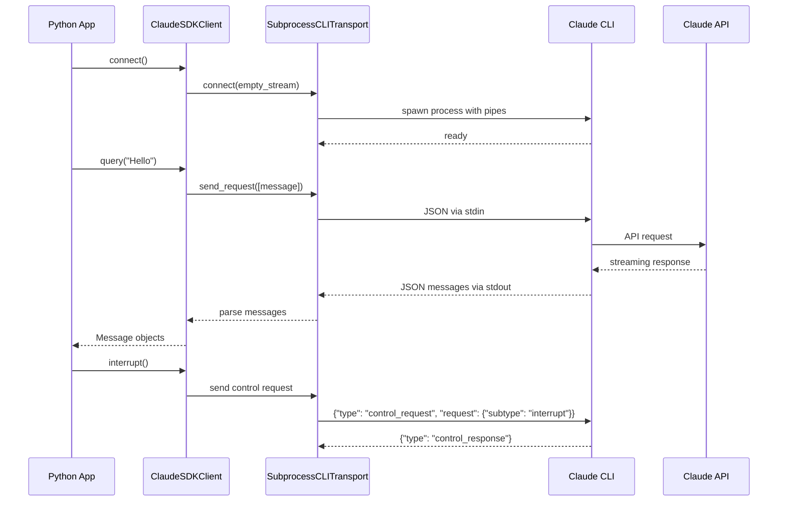

# ClaudeSDKClient Technical Analysis

## Architecture Overview

The ClaudeSDKClient implements bidirectional streaming communication with Claude Code through a sophisticated subprocess-based transport layer. Here's the high-level architecture:

```
┌─────────────────────┐      ┌──────────────────────┐
│  Python Application │      │   Claude Code CLI    │
│                     │      │                      │
│ ┌─────────────────┐ │      │ ┌──────────────────┐ │
│ │ ClaudeSDKClient │ │      │ │  Stream Handler  │ │
│ └───────┬─────────┘ │      │ └────────┬─────────┘ │
│         │           │      │           │           │
│ ┌───────▼─────────┐ │      │ ┌────────▼─────────┐ │
│ │ SubprocessCLI   │ │◄────►│ │   JSON Stream    │ │
│ │ Transport       │ │ Pipes│ │   Input/Output   │ │
│ └───────┬─────────┘ │      │ └──────────────────┘ │
│         │           │      │                      │
│ ┌───────▼─────────┐ │      │                      │
│ │ Message Parser  │ │      │                      │
│ └─────────────────┘ │      │                      │
└─────────────────────┘      └──────────────────────┘
        Python SDK                  Node.js CLI
```

## Transport Mechanism Deep Dive

### SubprocessCLITransport

The `SubprocessCLITransport` class is the core of the bidirectional communication system. It manages a subprocess running the Claude Code CLI with specific arguments for streaming mode.

#### Key Components:

1. **Process Management**
   - Uses `anyio.open_process()` for cross-platform async subprocess creation
   - Maintains three pipes: stdin, stdout, stderr
   - Wraps pipes in `TextReceiveStream` and `TextSendStream` for async I/O

2. **Command Construction**
   - Builds CLI command with `--output-format stream-json` for structured output
   - Uses `--input-format stream-json` for bidirectional mode
   - Passes configuration options (model, tools, system prompt, etc.)

3. **Connection Modes**
   - **String Mode**: Legacy mode where prompt is passed via `--print` argument
   - **Streaming Mode**: Full bidirectional mode with persistent stdin pipe

### Message Flow



## Protocol Analysis

### Message Protocol

The communication uses newline-delimited JSON (NDJSON) format over stdin/stdout pipes.

#### Input Messages (Python → CLI)

1. **User Messages**
```json
{
  "type": "user",
  "message": {
    "role": "user",
    "content": "What is 2+2?"
  },
  "parent_tool_use_id": null,
  "session_id": "default"
}
```

2. **Control Messages**
```json
{
  "type": "control_request",
  "request_id": "req_1_abcd1234",
  "request": {
    "subtype": "interrupt"
  }
}
```

#### Output Messages (CLI → Python)

1. **Assistant Messages**
```json
{
  "type": "assistant",
  "message": {
    "content": [
      {"type": "text", "text": "The answer is 4."},
      {"type": "tool_use", "id": "tool_1", "name": "Calculator", "input": {}}
    ]
  }
}
```

2. **System Messages**
```json
{
  "type": "system",
  "subtype": "permission_request",
  "data": {...}
}
```

3. **Result Messages**
```json
{
  "type": "result",
  "subtype": "success",
  "duration_ms": 1234,
  "duration_api_ms": 1000,
  "is_error": false,
  "num_turns": 1,
  "session_id": "default",
  "total_cost_usd": 0.0012,
  "usage": {...}
}
```

### Buffer Management

The transport implements sophisticated buffer management:

- **JSON Buffer**: Accumulates partial JSON until a complete object can be parsed
- **Max Buffer Size**: 1MB limit to prevent memory exhaustion
- **Speculative Parsing**: Attempts to parse after each line, continues accumulating on failure

## Error Handling

### Process Lifecycle Errors

1. **CLI Not Found**: Detailed error messages with installation instructions
2. **Process Termination**: Graceful shutdown with timeout, then force kill
3. **Connection Loss**: Detected via pipe closure and process exit

### Protocol Errors

1. **JSON Decode Errors**: Caught and re-raised with context
2. **Buffer Overflow**: Raises `SDKJSONDecodeError` when buffer exceeds 1MB
3. **Control Request Failures**: Propagated from CLI as `CLIConnectionError`

### Stream Errors

1. **Closed Resource**: Handled gracefully for expected disconnections
2. **Generator Exit**: Properly handled when client stops consuming messages
3. **Stderr Collection**: Limited to 10MB with 30-second timeout

## Performance Considerations

### Async I/O Optimization

- Uses `anyio` for runtime-agnostic async operations
- Non-blocking I/O on all pipes
- Concurrent message consumption and sending

### Memory Management

- **Streaming Processing**: Messages processed one at a time
- **Buffer Limits**: 1MB for JSON, 10MB for stderr
- **No Message Queuing**: Direct pipe-to-consumer flow

### Process Overhead

- **Single Subprocess**: One CLI process per client instance
- **Persistent Connection**: Avoids repeated process spawning
- **Pipe Buffering**: OS-level buffering for smooth data flow

## Integration with Claude Code CLI

### CLI Requirements

- Claude Code CLI must support `--input-format stream-json`
- Output format must be `--output-format stream-json`
- CLI handles the actual Claude API communication

### Session Management

- Sessions identified by `session_id` field
- CLI maintains conversation context per session
- Multiple sessions can be interleaved in streaming mode

### Tool Execution

- Tools specified via `--allowedTools` CLI argument
- Tool results streamed back as part of assistant messages
- Permission prompts handled via system messages

## Limitations and Considerations

### Current Limitations

1. **Platform Dependency**: Requires Node.js and npm for CLI installation
2. **Process Overhead**: Each client spawns a separate CLI process
3. **No Direct API Access**: All communication goes through CLI subprocess
4. **Text-Only Pipes**: Binary data must be encoded (e.g., base64)

### Design Trade-offs

1. **Subprocess vs Direct API**
   - Pro: Leverages existing CLI functionality
   - Pro: Automatic updates via npm
   - Con: Additional process overhead
   - Con: Potential for pipe buffer issues

2. **Streaming vs Request-Response**
   - Pro: Real-time interaction capability
   - Pro: Interrupt support
   - Con: More complex state management
   - Con: Requires continuous message consumption

### Future Considerations

1. **WebSocket Transport**: Could replace subprocess for lower overhead
2. **Direct API Client**: Native Python implementation without CLI dependency
3. **Message Queuing**: Internal buffer for better backpressure handling
4. **Binary Protocol**: More efficient than JSON for large payloads

## Comparison with Similar APIs

### vs OpenAI Streaming

- **Similar**: Async iterator pattern for responses
- **Different**: Subprocess transport vs HTTP/SSE
- **Unique**: Bidirectional capability with interrupts

### vs LangChain Streaming

- **Similar**: Callback-based message handling
- **Different**: Direct subprocess control
- **Unique**: Integrated with Claude Code's tool ecosystem

### vs Anthropic Python SDK

- **Similar**: Typed message objects
- **Different**: Full CLI integration
- **Unique**: Supports Claude Code's specialized tools

## Security Considerations

1. **Process Isolation**: Each client runs in separate subprocess
2. **No Direct Env Access**: CLI process has controlled environment
3. **Input Validation**: JSON parsing provides basic validation
4. **Resource Limits**: Buffer sizes prevent memory exhaustion

## Conclusion

The ClaudeSDKClient provides a sophisticated bidirectional streaming interface through clever use of subprocess pipes and JSON streaming. While the subprocess approach adds overhead compared to direct API calls, it enables tight integration with Claude Code's existing CLI infrastructure and tool ecosystem. The implementation demonstrates careful attention to error handling, resource management, and async programming patterns, making it suitable for building interactive AI applications with real-time requirements.